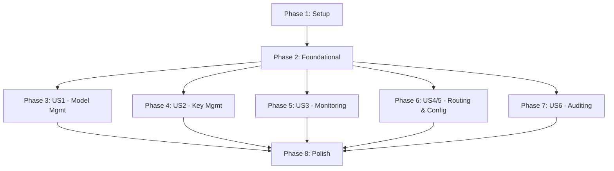

# Task Plan: MCP Server for LiteLLM Administration

This plan outlines the development tasks for creating the LiteLLM MCP Management Server, broken down by user story to facilitate incremental and parallel development.

## Implementation Strategy

The project will be developed in phases, aligned with user stories. The MVP (Minimum Viable Product) will consist of completing Phase 1, 2, and 3, which will deliver a functional server capable of managing model deployments. Subsequent user stories can be implemented incrementally.

## Dependencies

---

## Phase 1: Project Setup
*Goal: Initialize the project structure and configuration files.*

- [ ] T001 Create root directory for the new server at `mcp_server/`
- [ ] T002 Create empty `__init__.py` file in `mcp_server/`
- [ ] T003 Create `requirements.txt` file in `mcp_server/` with initial dependencies (`mcp`, `psycopg2-binary`, `httpx`, `pyyaml`, `pydantic`)
- [ ] T004 Create `Dockerfile` in `mcp_server/` as defined in the quickstart guide
- [ ] T005 Create `schema/` directory inside `mcp_server/`
- [ ] T006 Create an empty `database_schema.md` file in `mcp_server/schema/`
- [ ] T007 Create `tests/` directory at the repository root

---

## Phase 2: Foundational Components
*Goal: Implement core connectors and the main server loop that all tools will depend on.*

- [ ] T008 Implement the basic MCP server loop and tool registration logic in `mcp_server/litellm_mcp.py`
- [ ] T009 Implement the stdio entry point in `mcp_server/__main__.py` to run the server
- [ ] T010 [P] Implement the PostgreSQL database connector in `mcp_server/db_connector.py`, including connection pooling and transaction management
- [ ] T011 [P] Implement the LiteLLM Admin API client in `mcp_server/admin_api.py`, including bearer token authentication

---

## Phase 3: User Story 1 - Dynamic Model Management
*Goal: Implement tools to add, remove, list, and update model deployments.*
*Independent Test: An AI assistant can add a new model, see it in the list, update its limits, and then remove it.*

- [ ] T012 [US1] Implement the `add_model` tool logic in `mcp_server/litellm_mcp.py`
- [ ] T013 [US1] Implement the `remove_model` tool logic in `mcp_server/litellm_mcp.py`
- [ ] T014 [P] [US1] Implement the `list_models` tool logic in `mcp_server/litellm_mcp.py`
- [ ] T015 [P] [US1] Implement the `update_model_limits` tool logic in `mcp_server/litellm_mcp.py`

---

## Phase 4: User Story 2 - Secure Client Access Control
*Goal: Implement tools for creating and managing virtual API keys.*
*Independent Test: An AI assistant can create a key, list it, update its budget, and then revoke it.*

- [ ] T016 [US2] Implement the `create_virtual_key` tool logic in `mcp_server/litellm_mcp.py`
- [ ] T017 [US2] Implement the `revoke_key` tool logic in `mcp_server/litellm_mcp.py`
- [ ] T018 [P] [US2] Implement the `list_keys` tool logic in `mcp_server/litellm_mcp.py`
- [ ] T019 [P] [US2] Implement the `update_key_budget` tool logic in `mcp_server/litellm_mcp.py`

---

## Phase 5: User Story 3 - Real-time Operational Oversight
*Goal: Implement tools for monitoring health, spend, and logs.*
*Independent Test: An AI assistant can ask for the system health, today's spend, and recent error logs.*

- [ ] T020 [P] [US3] Implement the `get_proxy_health` tool logic in `mcp_server/litellm_mcp.py`
- [ ] T021 [P] [US3] Implement the `get_service_health` tool logic in `mcp_server/litellm_mcp.py`
- [ ] T022 [US3] Implement the `get_spend_dashboard` tool logic in `mcp_server/litellm_mcp.py`
- [ ] T023 [US3] Implement the `debug_failed_requests` tool logic in `mcp_server/litellm_mcp.py`
- [ ] T024 [P] [US3] Implement the `get_recent_logs` tool logic in `mcp_server/litellm_mcp.py`

---

## Phase 6: User Stories 4 & 5 - Routing and Configuration
*Goal: Implement tools for managing routing strategies, fallbacks, and config persistence.*
*Independent Test: An AI can change the routing strategy and restore a configuration from a backup.*

- [ ] T025 [P] [US4] Implement the `update_routing_strategy` tool logic in `mcp_server/litellm_mcp.py`
- [ ] T026 [P] [US5] Implement the `add_fallback_chain` tool logic in `mcp_server/litellm_mcp.py`
- [ ] T027 [P] [US5] Implement the `remove_fallback_chain` tool logic in `mcp_server/litellm_mcp.py`
- [ ] T028 [P] [US5] Implement the `list_fallback_chains` tool logic in `mcp_server/litellm_mcp.py`
- [ ] T029 [US4] Implement the `sync_config_to_yaml` tool logic in `mcp_server/litellm_mcp.py`
- [ ] T030 [US4] Implement the `reload_config_from_yaml` tool logic in `mcp_server/litellm_mcp.py`
- [ ] T031 [P] [US4] Implement the `list_config_backups` tool logic in `mcp_server/litellm_mcp.py`
- [ ] T032 [US4] Implement the `restore_config_backup` tool logic in `mcp_server/litellm_mcp.py`

---

## Phase 7: User Story 6 - Auditing
*Goal: Implement the audit log query tool.*
*Independent Test: An AI can perform an action and then view that action in the audit log.*

- [ ] T033 [US6] Implement the `get_audit_log` tool logic in `mcp_server/litellm_mcp.py`

---

## Phase 8: Polish & Cross-Cutting Concerns
*Goal: Implement final features that apply to all tools, like auditing and background syncing.*

- [ ] T034 Create the `mcp_audit_log` table schema in `mcp_server/schema/database_schema.md`
- [ ] T035 Implement the `@audit_tool` decorator and apply it to all tool functions in `mcp_server/litellm_mcp.py`
- [ ] T036 Implement the background worker for the "Auto-Sync to YAML" strategy in `mcp_server/config_sync.py`
- [ ] T037 Integrate and start the background sync worker from the main server logic in `mcp_server/litellm_mcp.py`
- [ ] T038 Review all code for error handling, logging, and adherence to the design.

## Parallel Execution Examples

- **Within US3**: `get_proxy_health` (T020), `get_service_health` (T021), and `get_recent_logs` (T024) can be developed in parallel as they are independent read-only operations.
- **Across Stories**: Once Phase 2 is complete, work on User Story 1 (T012-T015) can happen in parallel with User Story 2 (T016-T019) as they affect different database tables and API endpoints.
